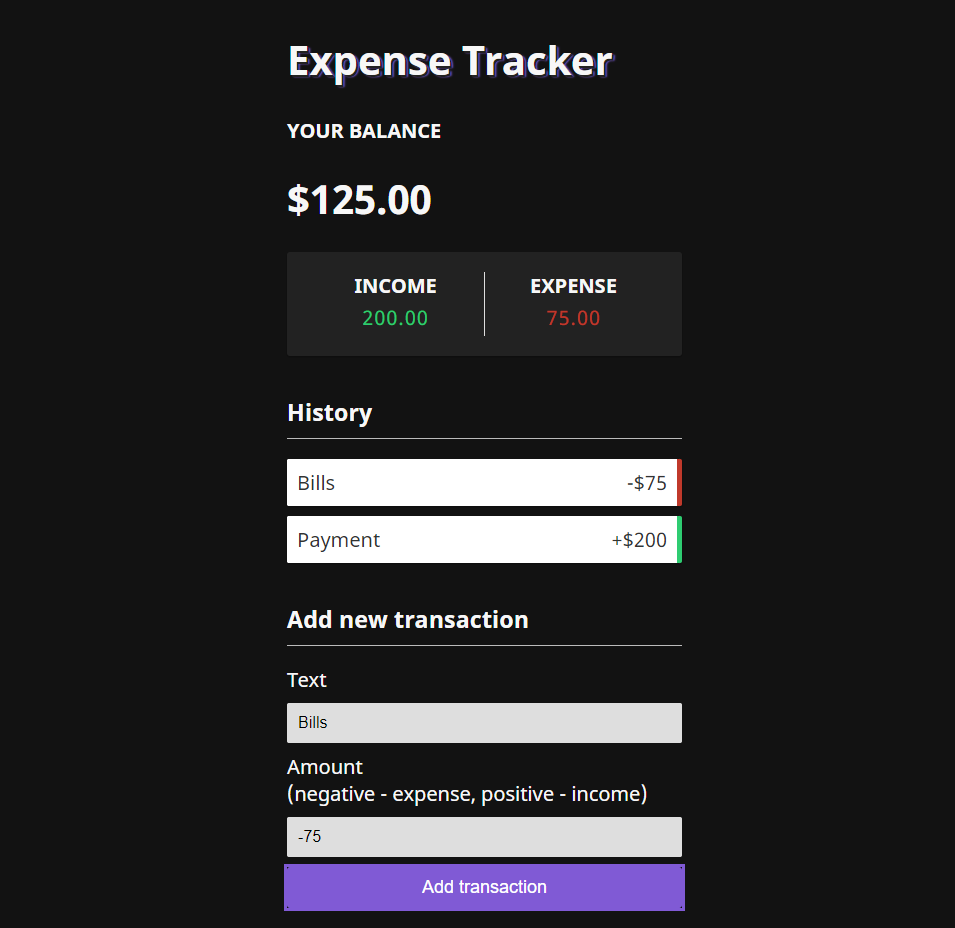
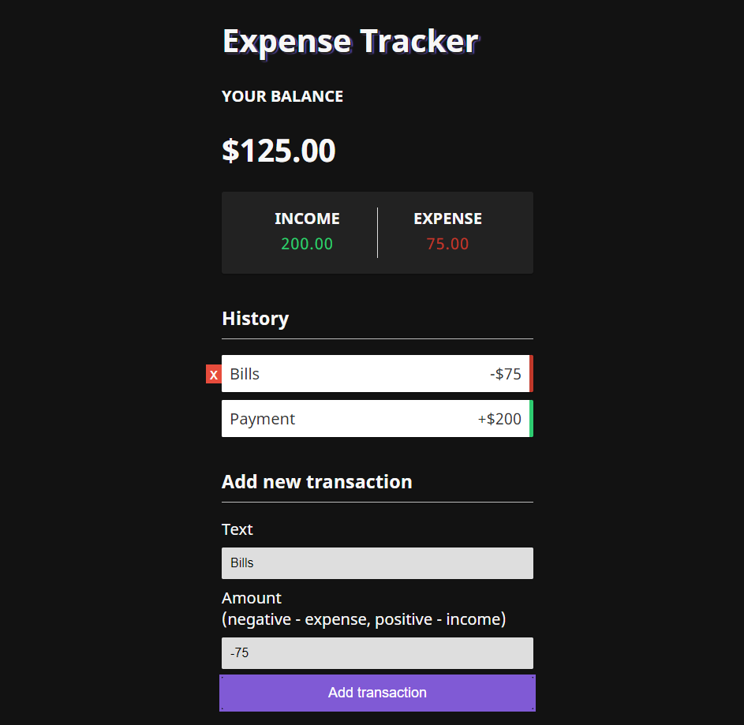

<h1>:moneybag: Expense Tracker </h1>

*Expense tracking application built with React*

:bookmark_tabs: Todos:
  - Add backend with Express and MongoDB for a full stack application
  - Make addTransaction responsive, cannot use minus key on mobile device

 
<h3>- Click to delete transactions -</h3>

